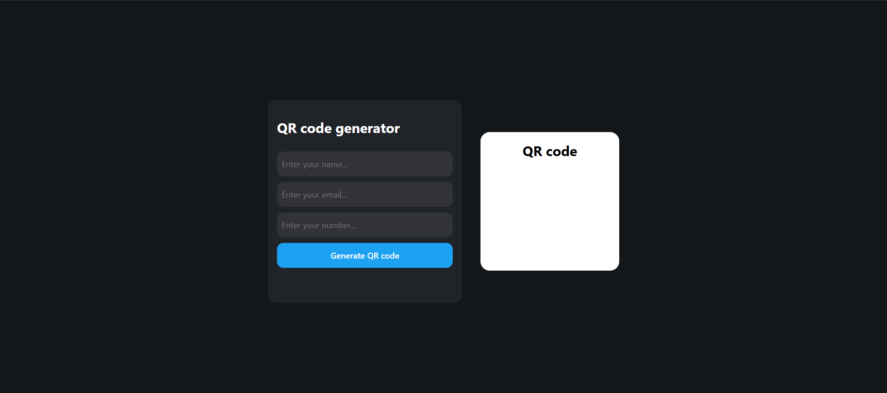

# QR-Code-Gen
Random QR-Code Generator created using HTML, CSS and Javascript.

This project generates a QR code based on user input, including name, email, and phone number. The QR code is displayed on the page, and users can download or share it as needed.

## Functionality

* Users can input their name, email, and phone number in the provided fields.
* Upon clicking the "Generate QR code" button, the application creates a QR code based on the user's input.
* The QR code is displayed on the page, and users can download or share it as needed.

## Technology Used

* HTML: Used for structuring the webpage and creating the user interface.
* CSS: Used for styling the webpage and creating a visually appealing design.
* Javascript: Used for generating the QR code and handling user input.
* QRCode.js library: Used for generating the QR code.

## Future Developments

### New Features

#### 1. Customizable QR Code Design

Allow users to customize the design of the QR code, such as changing the color scheme, adding a logo, or modifying the shape.

#### 2. Support for More Input Types

Expand the types of input that can be used to generate QR codes, such as URLs, text messages, or vCards.

#### 3. QR Code Analytics

Provide analytics on the usage of generated QR codes, such as scan counts, location data, and device information.

#### 4. Integration with Social Media

Allow users to share generated QR codes directly to social media platforms.

#### 5. Offline Support

Enable the application to function offline, allowing users to generate QR codes without an internet connection.

### Improvements

#### 1. Enhanced User Interface

Improve the user interface to make it more intuitive and user-friendly, with features such as tooltips, animations, and responsive design.

#### 2. Error Handling

Implement robust error handling to handle cases where user input is invalid or the QR code generation process fails.

#### 3. Security

Implement security measures to protect user data, such as encryption and secure storage of generated QR codes.

#### 4. Accessibility

Ensure that the application is accessible to users with disabilities.

#### 5. Performance Optimization

Optimize the application's performance to reduce loading times and improve overall responsiveness.

### Platforms and Integrations

#### 1. Mobile Apps

Develop mobile apps for iOS and Android to provide a native QR code generation experience.

#### 2. Web Extensions

Develop web extensions for popular browsers to provide a convenient QR code generation experience.

#### 4. API Integration

Provide APIs for other developers to integrate QR code generation into their own applications.

